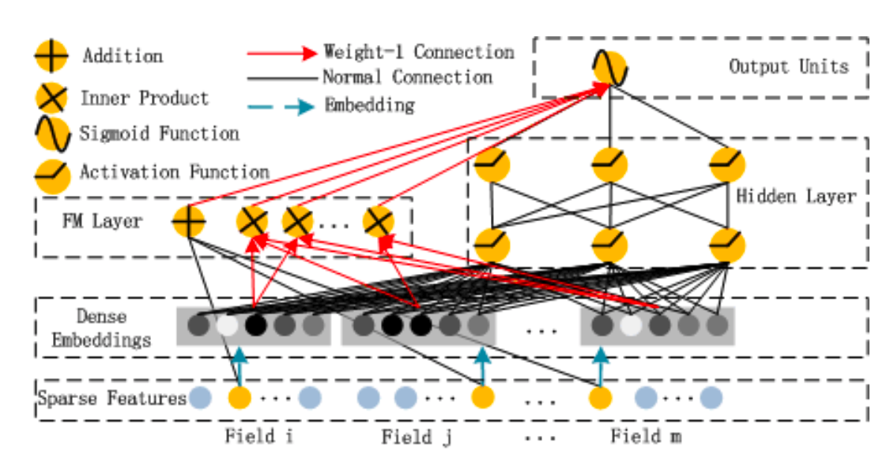

<!--
 * @Author: your name
 * @Date: 2020-04-15 13:16:08
 * @LastEditTime: 2020-06-08 18:39:00
 * @LastEditors: Please set LastEditors
 * @Description: In User Settings Edit
 * @FilePath: /DeepCTR/视频笔记/deepfm.md
 -->
http://fancyerii.github.io/2019/12/19/deepfm/

dnn部分和FM部分的embedding是共享的，而linear部分是自己的，因为按理来说linear部分只需要做onehot

dnn部分和linear部分都调用了input_from_feature_columns， 而input_from_feature_columns又调用了create_embedding_matrix，并且prefix不同，
所以dnn部分和linear部分是分别建立了embedding矩阵的，

深入理解deepfm架构

分为两部分

1. FM

    1. linear

        1. 从图中可以看出，线性部分的sparse feature并没有经过dense embeddings层，而是直接到了FM最左边的➕操作。如何实现把sparse feature进行加和的

        2. 线性部分其实就是原版的FM的线性部分，而FM的线性部分就是逻辑回归。而对于逻辑回归来说，
            
            1. dense feature就直接全连接
            2. sparse feature展开成onehot向量，进行全连接？？？
                
                1. 在deepctr中，线性层并不是使用onehot进行全连接的方式进行计算，而是使用了一个新的（不与fm和dnn共享）embedding矩阵，孰强孰弱不知道

                    1. dense feature concat之后，做了layer.dense全连接
                    2. sparse featrue也维护一套embeddign矩阵，并且在这里强行把embedding_dim置1了，所以和onehot的作用是一样的

    2. interaction

        通过dense embeddings层，和DNN公用embeddings
2. DNN

    通过dense embeddings层，和DNN公用embeddings