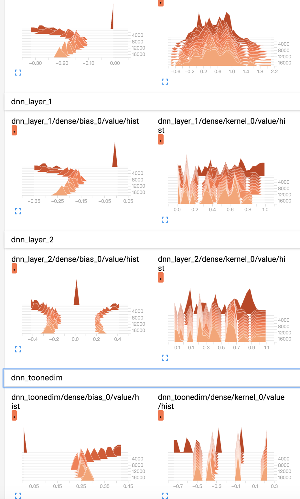
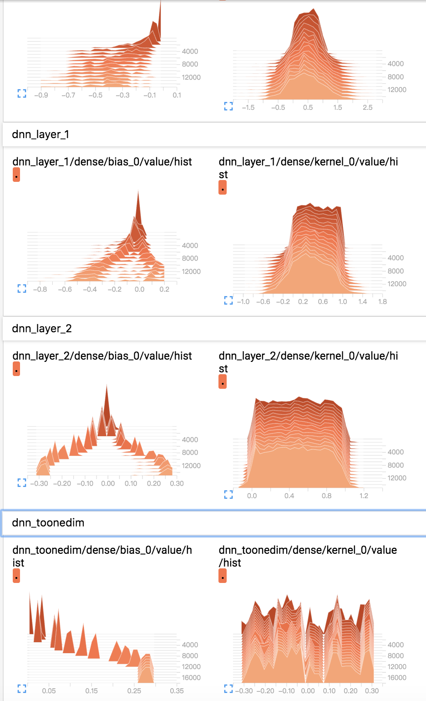

<!--
 * @Author: your name
 * @Date: 2020-06-10 09:38:46
 * @LastEditTime: 2020-06-11 09:31:01
 * @LastEditors: Please set LastEditors
 * @Description: In User Settings Edit
 * @FilePath: /DeepCTR/笔记/tensorboard指南.md
--> 

https://www.zhihu.com/question/63795427/answer/572974526

tensorboard监控的集中形式

1. scalars

    1. loss: 可以监控train loss和 val loss的下降曲线，对应调节

        1. learning rate
        2. 
        3. 
2. histograms
    1. weight

        
        1. 锯齿形：有一些神经元冗余了，所以获取了相同的信息，表现出相同的形状（锯齿尖）
        2. tf.initializer.    初始化对学习过程的变化决定性很强
        3. 保持原分布不动
            1. 模型太复杂，学不到这么多参数，下图是分别在4,4,4,1的dnn和64,64,64,1的dnn上训练的结果，可以看出64，64，64，1上前面3层的分布基本上没有太大的改变，而4，4，4，1发生了巨大的改变。 这说明64，64，64，1对于当前的数据集来说过于复杂（甚至参数量大于样本量），无法充分训练出有效的参数
            
            2. 浅梦表示看不出什么东西
    2. bias
    3. grad
    4. activation
    
            1. learning rate: 浅层的weight训练不明显，可以考虑缩小learning rate

3. distributions

    distributions和histograms是对相同数据的不同展现形式

4. embeddings

tensorboard多个图对比
https://manutdzou.github.io/2017/09/02/tensorboard.html

bn 和 dropout怎么调节

dropout只有在模型相对于数据来说很大的情况下比较必要，如果拥有大量数据，通常不会存在过拟合和泛化能力的问题